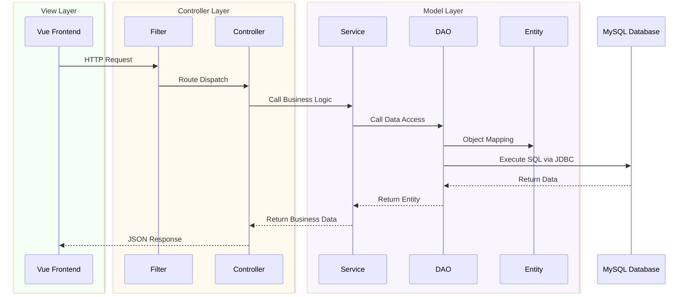

# Micro Headlines

## Introduction

Java web practice project.

Source: https://www.bilibili.com/video/BV1UN411x7xe

## Architecture

MVC architecture, front and back are separated.



Tech stack: Java Servlet, MySQL, JDBC, Vue.js.

## How to run

### Dependencies

- [Node.js 20.19+](https://nodejs.org/)
- [JDK 1.8+](https://www.oracle.com/java)
- [MySQL 8.0+](https://www.mysql.com/)
- [Tomcat 9](https://tomcat.apache.org/)

### Local

Front end:
```bash
cd front-end
npm install

# local run
npm run dev
```

Database:
```sql
create database micro_headlines;
use micro_headlines;
source database/micro_headlines.sql;
```

Back end:
- Open project in IDEA.
- Configure Tomcat and run the back-end module.

Optional:
```bash
# configure database connection
cd back-end/resources
vim jdbc.properties

# deploy
mv micro-headlines.war /path/to/tomcat/webapps/
cd /path/to/tomcat/bin
sh startup.sh
```

### Server

[Ubuntu](./docs/ubuntu.md)

## API Documentation
- [API Documentation](./docs/api.md)

## Thanks

Cursor and Claude Code for page beautification.
