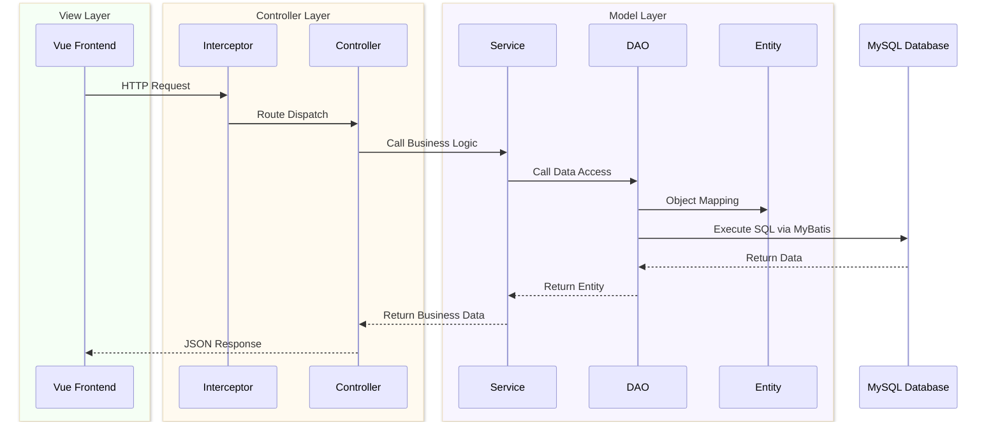

# Micro Headlines

## Introduction

Java web practice project.

Source: https://www.bilibili.com/video/BV1UN411x7xe

Course: 
- https://www.bilibili.com/video/BV1UN411x7xe
- https://www.bilibili.com/video/BV1Fi4y1S7ix

## Architecture

MVC architecture, front and back are separated.



**Tech stack**: Vue.js, Spring Boot, MyBatis, MySQL

## How to run

### Dependencies

- [Node.js 22](https://nodejs.org/)
- [JDK 17](https://www.oracle.com/java)
- [MySQL 8](https://www.mysql.com/)
- [Maven 3.9](https://maven.apache.org/)

### Local

Front end:
```bash
cd front-end
npm install

# local run
npm run dev
```

Database:
```sql
create database micro_headlines;
use micro_headlines;
source database/micro_headlines.sql;
```

Back end:
```bash
cd back-end

mvn clean compile
mvn spring-boot:run
```

### Server
Base environment
```bash
sudo apt update
sudo apt upgrade -y

# Java
sudo apt install openjdk-17-jdk -y

# Maven
sudo apt install maven -y

# MySQL
sudo apt install mysql-server -y

# Node js
curl -o- https://raw.githubusercontent.com/nvm-sh/nvm/v0.40.3/install.sh | bash
\. "$HOME/.nvm/nvm.sh"
nvm install 22

# Nginx
sudo apt install nginx -y
```
Database
```bash
# create database
sudo mysql -u root -p
create database micro_headlines;

# create user
create user 'micro_headlines'@'localhost' identified by '12345678';
grant all privileges on micro_headlines.* to 'micro_headlines'@'localhost';
flush privileges;
exit;

# import database
mysql -u micro_headlines -p micro_headlines < database/micro_headlines.sql;
```
Back end
```bash
cd back-spring-boot
mvn clean package

cd target
java -jar micro-headlines-0.0.1-SNAPSHOT.jar
```
Front end
```bash
cd front-end
npm install
npm run build

sudo vim /etc/nginx/sites-available/default
```
```nginx
server {
    listen 80;
    server_name your_domain_name_or_your_server_ip;
    
    root /opt/Micro-headlines/front-end/dist;
    index index.html index.htm;
    
    # redirect to index.html
    location / {
        try_files $uri $uri/ /index.html;
    }
    
    # redirect base_url to backend
    location /api/ {
        proxy_pass http://localhost:8080/;
        proxy_set_header Host $host;
        proxy_set_header X-Real-IP $remote_addr;
        proxy_set_header X-Forwarded-For $proxy_add_x_forwarded_for;
        proxy_set_header X-Forwarded-Proto $scheme;
    }
    
    location ~* \.(js|css|png|jpg|jpeg|gif|ico|svg)$ {
        expires 1y;
        add_header Cache-Control "public, immutable";
    }
}
```

## API
- [API Documentation](./docs/api.md)

## Thanks

Cursor and Claude Code for page beautification.
